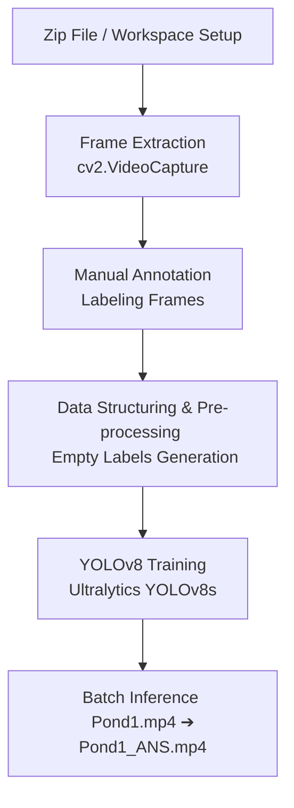

# 🐟 Fish Detection in Pond Monitoring Videos using YOLOv8

This repository implements an end-to-end computer vision pipeline to detect and track fish in pond monitoring videos. By extracting video frames, pre-processing annotations, training a state-of-the-art **YOLOv8** object detector, and running batch inference, the project automates the task of counting and observing aquatic life in real-time.

---

## 🎬 Project Output Demo

Here is the final processed video showing real-time detection and bounding boxes overlaid on the fish:

<video src="Pond1_ANS.mp4" controls="controls" width="100%"></video>

> [!TIP]
> *   If your Markdown viewer supports video playback, you can watch it directly above.
> *   Alternatively, play/open the output file directly: <video src="Pond1_ANS.mp4" controls="controls" width="100%"></video>.
> *   GitHub-compatible video player tag:
>     <video src="Pond1_ANS.mp4" width="100%" height="auto" controls autoplay loop muted></video>

---

## 📊 Project Pipeline Overview

The project follows a structured workflow from raw video data to automated predictions:



---

## 📂 Repository Structure

*   [Pond1.mp4](file:///c:/Users/Shubh/Downloads/Shrimp/Pond1.mp4) — The raw input video containing underwater/pond footage of fish.
*   [Pond1_ANS.mp4](file:///c:/Users/Shubh/Downloads/Shrimp/Pond1_ANS.mp4) — The final processed video with bounding boxes and confidence labels overlaid on the detected organisms.
*   [tr.ipynb](file:///c:/Users/Shubh/Downloads/Shrimp/tr.ipynb) — The complete Jupyter Notebook covering data preparation, frame extraction, preprocessing, YOLOv8 training, and inference.

---

## 🛠️ Step-by-Step Breakdown of the Workflow

The entire lifecycle of this project is encapsulated in [tr.ipynb](file:///c:/Users/Shubh/Downloads/Shrimp/tr.ipynb), divided into the following key steps:

### 1. Extraction & Environment Setup (Cells 1 & 2)
*   **Purpose**: Unzip dataset archives and prepare workspace folders.
*   **Details**: Utilizes Python's `zipfile` module to extract zipped dataset packages containing image and annotation files into target directories.

### 2. Video Frame Extraction (Cell 3)
*   **Purpose**: Extract individual frames from raw monitor videos to create a dataset for annotation.
*   **Details**: Processes the input MP4 file using OpenCV (`cv2.VideoCapture`). Each frame is saved sequentially as a JPEG image (`frame_000001.jpg`, etc.) in the target workspace folder.

### 3. Manual Annotation (External Step)
*   **Purpose**: Define ground truth boundaries for training the model.
*   **Details**: The extracted image frames undergo a manual annotation process using labeling tools (e.g., Roboflow, LabelImg) to output YOLO-formatted annotations (`.txt` files containing class and normalized bounding box coordinates: `class_id x_center y_center width height`).

### 4. Label Structuring & Pre-processing (Cell 4)
*   **Purpose**: Align the dataset directory and handle background images.
*   **Details**: Iterates through the images in the training dataset (`fish_project1/images/train`) and ensures every image has a corresponding label file in `fish_project1/labels/train`. If a frame has no annotations (no fish present), the script automatically creates an **empty `.txt` label file**. In YOLO, empty label files are essential as they serve as *negative background samples*, reducing false positive rates.

### 5. Google Drive Integration & YOLOv8 Training (Cells 5, 6, & 7)
*   **Purpose**: Train the target object detection model.
*   **Details**:
    *   Installs the `ultralytics` package.
    *   Mounts Google Drive (`google.colab.drive`) to load and store data during Google Colab sessions.
    *   Loads a pre-trained **YOLOv8s** (small) model.
    *   Trains the model using `model.train()` on the custom dataset defined by `data.yaml` for `50 epochs` at an image resolution of `640x640`.

### 6. Inference & Annotated Output Generation (Cells 8, 9, & 10)
*   **Purpose**: Deploy the trained model to process new video streams.
*   **Details**:
    *   Updates local OpenCV library versions to ensure compatibility.
    *   Loads the trained model weights (`best.pt`).
    *   Iterates through each frame of the input video [Pond1.mp4](file:///c:/Users/Shubh/Downloads/Shrimp/Pond1.mp4).
    *   Applies YOLO inference to detect fish, overlays bounding boxes on the frame using `results[0].plot()`, and compiles the frames back into [Pond1_ANS.mp4](file:///c:/Users/Shubh/Downloads/Shrimp/Pond1_ANS.mp4) using `cv2.VideoWriter`.

---

## 🚀 How to Run the Project

### Prerequisites
Make sure you have Python 3 installed. You can install the required dependencies using:
```bash
pip install ultralytics opencv-python
```

### Execution Steps
1.  **Extract Frames**: Run Cell 3 in [tr.ipynb](file:///c:/Users/Shubh/Downloads/Shrimp/tr.ipynb) pointing to your raw video path to generate dataset frames.
2.  **Annotate**: Use a tool like Roboflow or CVAT to annotate the extracted frames, downloading the dataset in **YOLO format**.
3.  **Run Preprocessing**: Execute Cell 4 to verify that every image has an accompanying label file (creating empty files for background/negative samples where needed).
4.  **Train the Model**: Mount Google Drive in Colab, reference your dataset config `data.yaml`, and run Cell 7 to start the training.
5.  **Generate Output Video**: Execute the inference block (Cell 10) with the path to the best weight file (`best.pt`) and the raw video [Pond1.mp4](file:///c:/Users/Shubh/Downloads/Shrimp/Pond1.mp4) to generate [Pond1_ANS.mp4](file:///c:/Users/Shubh/Downloads/Shrimp/Pond1_ANS.mp4).
